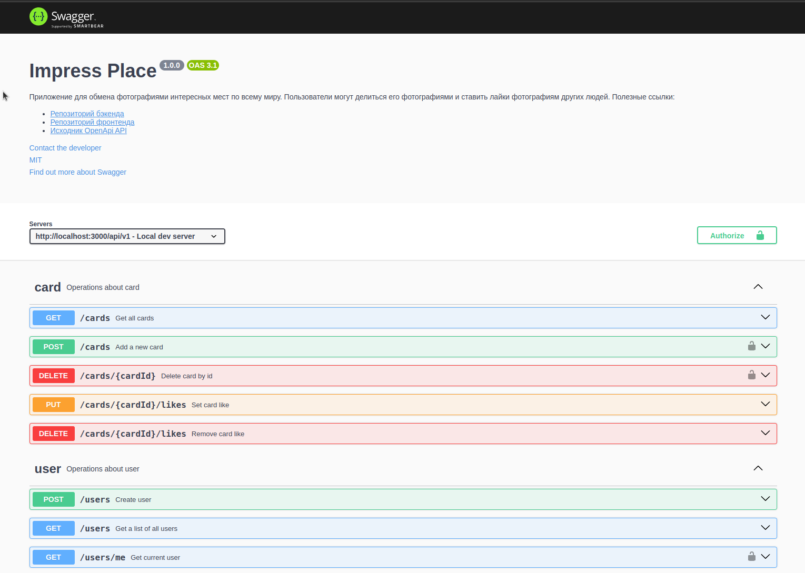

# Impress Place API

<br />
<div align="center">
  <a href="https://gvozdenkov.github.io/algoschool/">
    
  </a>
  <br/><br/>
  <p align="center">Share photos of amazing places with your friends</p>
  <br/>
</div>

## О проекте

Учебный REST API бэкенд для сервиса размещения фотографий `Impress Place`. Реализовал регистрацию и
аутентификацию пользователя с помощью `jwt` токенов. Пользователь может добавить фотографию, удалить
свою фотографию, поставить лайк любой фотографии и отредактировать свой профиль.

Пошёл дальше учебного задания и добавил документацию OpenAPI, докеризовал приложение и настроил
`pre-commit` хуки `husky`

- Бэкенд на `Express` / TypeScript
- База данных `MongoDB`
- ODM `Mongoose` для работы с базой



## Техники

:boom: Применил подход `Contract first` в работе с API (вдохновило
[видео Глеба Михеева](https://www.youtube.com/watch?v=-mzzT0b9K54)). Сначала создал спецификацию
`OpenAPI` в онлайн редакторе [swagger editor](https://editor-next.swagger.io/). Файл спецификации
[`openapi.yaml на гитхаб`](https://github.com/gvozdenkov/wish-magic/blob/main/backend/docs/openapi.yaml).
По нему создал REST API бэкенда.

Разобрался, как автоматически локализовать `OpenAPI` спецификацию с помощью
`swagger-i18n-extension`. При сборке контейнера из одного файла спецификации создаются
локализованные копии по языкам. После запуска в режиме разработки swagger спецификация доступна по
адресу http://localhost:3000/api/v1/docs/en/ и http://localhost:3000/api/v1/docs/ru/

:boom: Использовал версионирование API

:boom: Организовал код по бизнес доменам, а не по техническим обязанностям. Например, в `/user`
находятся все модули, относящиеся к `User` - контроллер, сервис, модель и утилиты. Таким образом
связанные сущности находятся в одном месте и общая структура приложения выразительно говорит о то,
про что это приложение. Так легче ориентироваться в коде

:boom: Покрыл API e2e тестами с помощью `Mocha` и `Supertest`. Использовал только e2e тесты
эндпоинтов для тестирования внешних взаимодействий. Опирался на книгу Владимира Хорикова -
[Принципы юнит-тестирования](https://www.piter.com/collection/bestsellery-manning/product/printsipy-yunit-testirovaniya).
Для моего случая чистого REST API выбрал стиль тестирования Проверка выходных данных. Этот стиль
черезвычайно устойчив к рефакторингу котодов базы, потому что не завязан на внутреннюю реализацию. Я
проверяю только то, что система выдаёт внешнему клиенту. И сопровождение тестов простое.

:boom: Для тестов в режиме разработки поднимается отдельный тестовый контейнер базы

:boom: Настроил проверку перед коммитами с помощью `husky`, `lint-staged` и `commitlint`. Коммит не
создаётся, если staged файлы не проходят линтер или сообщение коммита написано не по
[`Conventional Commits`](https://www.conventionalcommits.org/en/v1.0.0/)

## Local dev with Docker

```bash
git clone git@github.com:gvozdenkov/impress-place-backend.git

cd impress-place-backend

cp .env.example .env

docker compose -f compose.dev.yaml up --build
# or with Makefile
make run-dev

# запуск e2e тестов
yarn test
```

Бэкенд стартует по адерсу `http:localhost:3000/api/v1`

Документация OpenAPI по адресу `http:localhost:3000/api/v1/docs/ru`

Для запуска тестов `yarn test`. This will set `NODE_ENV` to `test` and run `mocha` integration tests
in separate test container.

## Планы по развитию

- [ ] Перевезти проект бэкенда и фронтенда в монорепозиторий с и
      [`pnpm workspace`](https://pnpm.io/workspaces) под управлением [`Nx`](https://nx.dev/)
- [ ] Перевести бэкенда на [`Fastify`](https://fastify.dev/)
- [ ] Поиграть с тем, чтобы написать бэк на чистой ноде, используя все возможностьи API ноды
- [ ] Добавить загрузку картинок не по ссылке, а файлами
- [ ] Прикрутить Redis для кэширования запросов к базе
- [ ] Прикрутить авторизацию с помощью Goolge, Yandex и VK

<details>
<summary>Workflow setup details</summary>

### Eslint

Install deps:

```bash
yarn add -D eslint eslint-config-airbnb-base eslint-config-airbnb-typescript @typescript-eslint/eslint-plugin @typescript-eslint/parser eslint-import-resolver-typescript eslint-plugin-import
```

### Prettier

Install exact versions (I have some bugs with prettier 3)

```bash
yarn add -D prettier@2.8.7 eslint-plugin-prettier@4.2.1 eslint-config-prettier
```

Add to eslint config:

```js
module.exports = {
  extends: [
    // add at the end of array!
    "pretter"
  ],
  plugins: {
    "prettier"
  },
  rules: {
    // highlight prettier errors
    "prettier/prettier": ["error"],
  }
}
```

Add script in `package.json` fix prettier styles:

```json
"scripts": {
  "prettier:write": "prettier --write ./**/*.{ts,js} ./*.{json,md,yml} -l",
}
```

### Commit check

This project is [Commitizen](https://www.npmjs.com/package/commitizen?activeTab=readme) friendly. So
you can easy create commits in a step by step guide by run:

```bash
yarn cz
```

If you are mannually create commit message it will be linted with `commitlint` to lint commit
messages acording with [Conventional Commits](https://www.conventionalcommits.org/en/v1.0.0/).

- `husky` & `lint-stage` to fix & lint staged files before commit.
- `commitlint` to lint commit message according
  [Conventional Commits](https://www.conventionalcommits.org/en/v1.0.0/)

Install deps:

```bash
yarn add -D cz-git commitizen @commitlint/cli @commitlint/config-conventional @commitlint/format
```

## API Documentation

I use the Contract First approach when developing APIs based on OpenApi v3.1

1. Created a contract document describing the API in the `/docs/openapi.yaml` folder.
2. I use the `swagger-i18n-extension` package to generate localized copies of the docs.

```json
 "swagger:docs": "yarn swagger-i18n-extension translate-all ./docs/openapi.yaml"
```

This script generate localized versions from the `./docs/openapi.yaml`

I use `swagger-ui-express` serve docs on `/docs` route. For example for `en`: `/api/v1/docs/en`

```ts
// app.ts

// add router for app & docs
app.use('/api/v1', router);

// router.ts

router.use('/docs', docRouter);

// docRouter.ts

// download .yaml specs
var openApiSpecRu = YAML.load(fs.readFileSync('docs/openapi.rus.yaml', 'utf-8'));
var openApiSpecEn = YAML.load(fs.readFileSync('docs/openapi.eng.yaml', 'utf-8'));

// server localized swagger docs on different routes
docRouter.use('/en', swaggerUi.serveFiles(openApiSpecEn, {}), swaggerUi.setup(openApiSpecEn));
docRouter.use('/ru', swaggerUi.serveFiles(openApiSpecRu, {}), swaggerUi.setup(openApiSpecRu));
```

## Test Driven Development

I decided to use only integration tests because only the server responses are important to the end
user. The model and access to the database do not require testing. If something goes wrong at this
stage, the tests will automatically fail. This makes the tests resistant to refactoring. You can
replace the database and internal processes, the only important thing is that the server response
remains the same

```bash
yarn add mocha @types/mocha chai @types/chai tsx
```

Use Mocha & Chai for testing

Use `tsx` to work with .ts test files. Create `mocharc.json` to config Mocha for TS (spec/test files
located near the tested files in `src`):

```json
{
  "require": ["tsx"],
  "extensions": ["ts"],
  "spec": ["src/**/*.spec.*"],
  "watch-files": ["src"]
}
```

Add script to `package.json`:

```diff
  "scripts": {
+    "test": "cross-env NODE_ENV=test mocha 'src/**/*.{spec,test}.ts'",
+    "test:watch": "mocha --watch",
  },
```

Run `yarn test` to run mocha tests

Run `yarn test:watch` to run mocha in watch mode to rerun tests on edits (not workin well with ts
now...)

</details>
